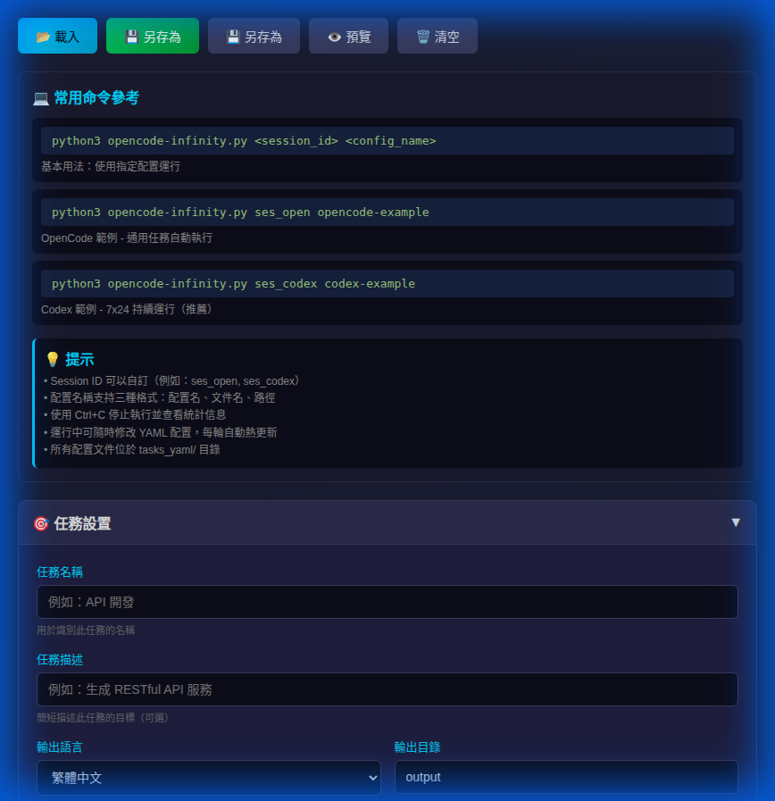
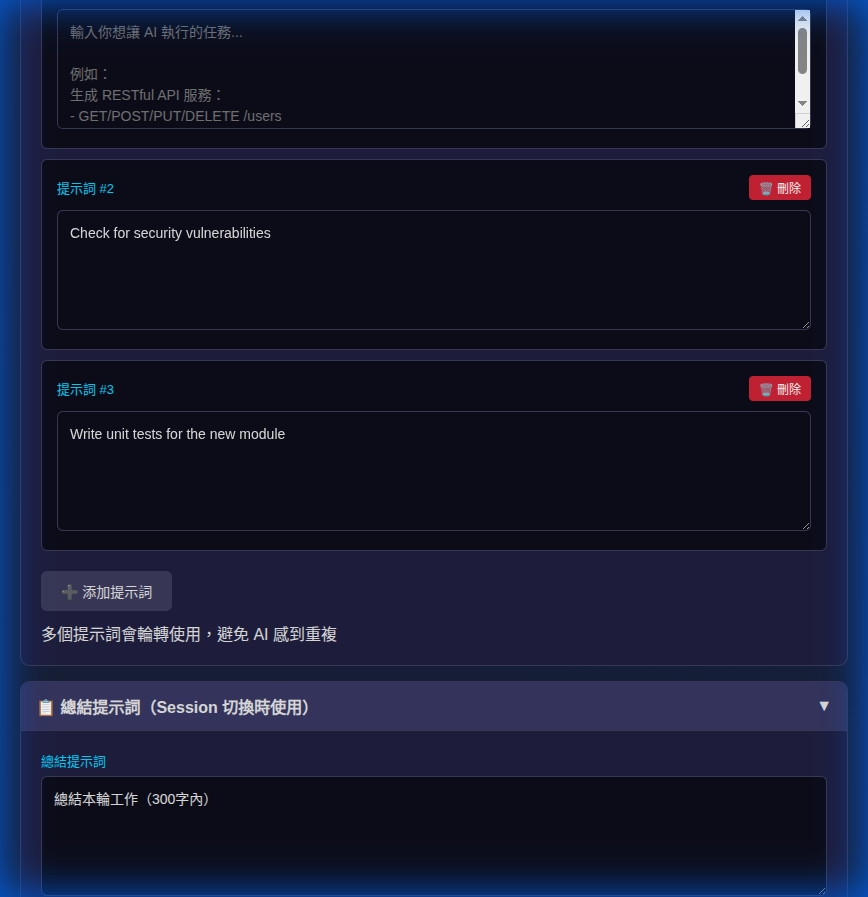
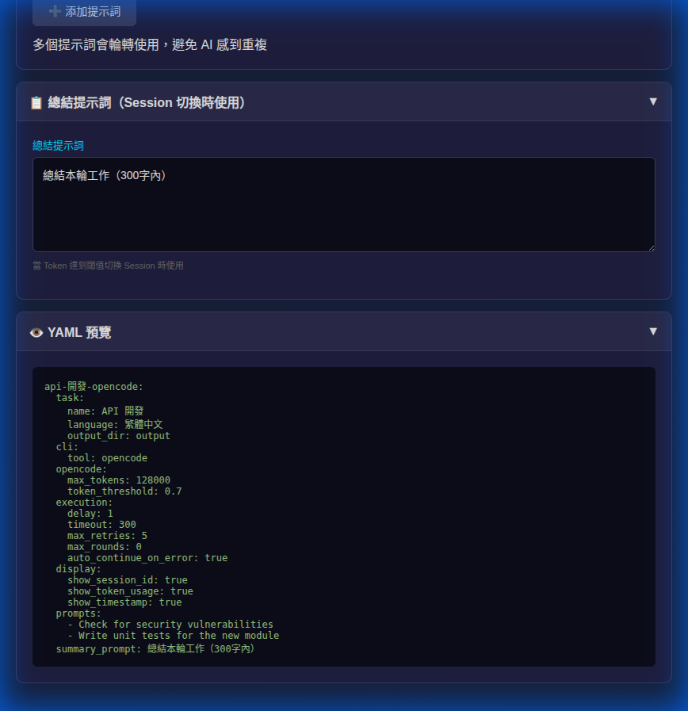

# OpenCode Infinity ⚡

多 CLI 工具自動執行系統，支持 OpenCode、Claude、Codex、Copilot。

## 核心功能

- �� **多提示詞輪轉**：支持多個提示詞循環使用，避免 AI 感到重複
- 🔗 **上下文傳遞**：Session 切換時自動傳遞最後幾輪對話，保持工作連續性
- 🔥 **熱更新配置**：運行中可隨時修改 YAML 配置，每輪自動熱更新
- 🛠️ **多 CLI 支持**：OpenCode、Claude、Codex、Copilot
- 📊 **Token 管理**：自動監控 Token 使用量，達到閾值自動切換 Session
- 🎯 **智能重試**：執行失敗自動重試，超時時間動態調整
- 🎨 **視覺化編輯器**：HTML 配置編輯器，無需手動編輯 YAML
- 🔁 **Session 切換**：自動生成新 Session ID，保持工作連續性


## 快速開始

### 1. 安裝依賴

```bash
pip3 install pyyaml
```

### 2. 配置任務

使用 HTML 編輯器（推薦）：



```bash
# 在瀏覽器中打開
open yaml-editor.html
```

或手動編輯 YAML 配置文件（`tasks_yaml/*.yaml`）。

### 3. 運行任務

```bash
python3 opencode-infinity.py <session_id> <config_name>
```

**範例：**

```bash
# OpenCode 範例
python3 opencode-infinity.py ses_open opencode-example

# Codex 範例（推薦）
python3 opencode-infinity.py ses_codex codex-example

# 使用文件名
python3 opencode-infinity.py ses_api opencode-example.yaml

# 使用相對路徑
python3 opencode-infinity.py ses_test tasks_yaml/codex-example.yaml

# 使用絕對路徑
python3 opencode-infinity.py ses_dev /home/user/config.yaml
```

## 配置範例

項目包含 2 個精選配置範例：

### 1. OpenCode 範例 (`opencode-example.yaml`)
- 通用任務自動執行
- 展示所有 OpenCode 配置選項
- 包含 3 個輪轉提示詞

### 2. Codex 範例 (`codex-example.yaml`)
- 7x24 持續運行
- 展示所有 Codex 配置選項
- 包含 3 個輪轉提示詞
- **推薦使用**

## 配置格式

### 基本結構

```yaml
config-name:
  # 任務配置
  task:
    name: "任務名稱"
    description: "任務描述（可選）"
    language: "繁體中文"
    output_dir: "output"
  
  # CLI 工具配置
  cli:
    tool: "codex"  # opencode, claude, codex, copilot
    commands:
      run_session: "codex exec resume --skip-git-repo-check"
  
  # OpenCode 設置
  opencode:
    model: "openai/gpt-5.2-codex"  # 可選，指定模型
    max_tokens: 128000
    token_threshold: 0.7
  
  # 執行設置
  execution:
    delay: 1                        # 每輪延遲（秒）
    timeout: 300                    # 基礎超時（秒）
    max_retries: 5                  # 最大重試次數
    max_rounds: 0                   # 最大輪次（0 = 無限制）
    auto_continue_on_error: true    # 錯誤時自動繼續
  
  # 顯示設置
  display:
    show_session_id: true      # 顯示 session ID
    show_token_usage: true     # 顯示 token 使用量
    show_timestamp: true       # 顯示時間戳
  
  # 提示詞（輪轉使用）
  prompts:
    - "第一個提示詞"
    - "第二個提示詞"
    - "第三個提示詞"
  
  # 總結提示詞（達到 token 閾值時使用）
  summary_prompt: "總結本輪工作（300字內）"
```

### 多提示詞輪轉

支持多個提示詞，系統會自動輪轉使用：

```yaml
prompts:
  - |
    生成實用工具代碼：
    - 創建通用函數庫
    - 包含完整文檔
    - 添加單元測試
  - |
    優化現有代碼：
    - 改進代碼結構
    - 提升性能
    - 增強錯誤處理
  - |
    完善項目文檔：
    - 更新 README
    - 添加使用範例
    - 補充 API 說明
```



**輪轉邏輯：**
- 第 1 輪：使用提示詞 #1
- 第 2 輪：使用提示詞 #2
- 第 3 輪：使用提示詞 #3
- 第 4 輪：使用提示詞 #1（循環）
- ...

## 熱更新配置

運行中可隨時修改 YAML 配置文件，系統會在每輪執行前自動重新載入配置。

**可熱更新的參數：**
- ✅ 提示詞內容（prompts）
- ✅ 延遲時間（delay）
- ✅ 超時設置（timeout）
- ✅ 重試次數（max_retries）
- ✅ 最大輪次（max_rounds）
- ✅ 錯誤處理（auto_continue_on_error）
- ✅ 顯示設置（show_session_id, show_token_usage, show_timestamp）
- ✅ Token 閾值（token_threshold）
- ✅ 總結提示詞（summary_prompt）

**使用方法：**
1. 啟動程序
2. 修改 YAML 配置文件
3. 保存文件
4. 下一輪自動使用新配置

## HTML 編輯器

### 功能特點

- 📂 **載入配置**：支持載入現有 YAML 文件
- 💾 **保存/另存為**：智能保存模式
  - 已載入文件：直接保存到原文件
  - 未載入文件：提示輸入文件名（另存為）
- ➕ **多提示詞管理**：動態添加/刪除提示詞
- 👁️ **即時預覽**：查看生成的 YAML 配置



- 🎨 **視覺化介面**：可折疊區塊，表單輸入
- 💻 **命令參考**：內建常用命令範例

### 使用方法

1. 打開 `yaml-editor.html`
2. 填寫任務設置、CLI 配置、執行設置
3. 添加多個提示詞（點擊「➕ 添加提示詞」）
4. 點擊「💾 保存」或「💾 另存為」
5. 將生成的 YAML 文件放到 `tasks_yaml/` 目錄

## CLI 工具支持

### OpenCode

```yaml
cli:
  tool: "opencode"
```

### Claude

```yaml
cli:
  tool: "claude"
```

### Codex（推薦）

```yaml
cli:
  tool: "codex"
  commands:
    run_session: "codex exec resume --skip-git-repo-check"
```

**注意：** `--skip-git-repo-check` 參數允許在任何目錄運行 Codex。

### Copilot

```yaml
cli:
  tool: "copilot"
```

## Session 切換

當 Token 使用量達到閾值（如 70%）時，系統會自動：

1. 執行 `summary_prompt` 總結當前工作
2. **導出最後 3-5 輪對話作為上下文**（僅 OpenCode）
3. **創建新 Session 並傳遞上下文**（僅 OpenCode）
4. 生成新的 Session ID（如 `ses_api_1` → `ses_api_2`）
5. 繼續執行任務

### 上下文傳遞功能

**僅 OpenCode 支持**，確保 AI 記住之前的工作內容：

- **自動導出**：提取最後 3-5 輪對話（每條限制 500 字符）
- **智能傳遞**：創建新 Session 時帶上下文
- **工作連續性**：AI 知道之前做了什麼，無縫繼續工作
- **回退機制**：如果自動創建失敗，回退到手動生成 Session ID

**範例輸出：**

```
══════════════════════════════════════════════════════════════════════
[腳本] OpenCode Infinity 啟動
  CLI 工具: OPENCODE
  任務: API 開發任務
  描述: 生成 RESTful API 服務
  切換策略: TOKEN
  最大輪次: 0 輪
  語言: 繁體中文
  輸出目錄: output/
══════════════════════════════════════════════════════════════════════

══════════════════════════════════════════════════════════════════════
[腳本] 第 5 輪 | Session #1 | 14:30:15
  Session ID: ses_api
  標題: API 開發任務
  Token: 89,600/128,000 (70.0%)
⚠ 達到 Token 閾值 (70.0%)，準備切換 Session
══════════════════════════════════════════════════════════════════════

[腳本] 執行總結提示詞
...
✓ 總結完成

[腳本] 導出上下文...
✓ 已導出上下文（1250 字符）

══════════════════════════════════════════════════════════════════════
[腳本] 切換 Session: ses_api → ses_api_2
✓ 已創建新 Session（帶上下文）
══════════════════════════════════════════════════════════════════════
```

## 智能重試機制

系統內建智能重試機制，自動處理執行失敗和超時：

### 重試策略

- **指數退避**：超時時間隨重試次數倍增
  - 第 1 次：300 秒（5 分鐘）
  - 第 2 次：600 秒（10 分鐘）
  - 第 3 次：1200 秒（20 分鐘）
  - 第 4 次：2400 秒（40 分鐘）
  - 第 5 次：3600 秒（60 分鐘，最大值）

- **重試延遲**：每次重試前等待 3 秒，避免立即重試

- **優雅終止**：
  1. 首先發送 SIGTERM 信號（優雅終止）
  2. 等待 5 秒讓進程正常退出
  3. 如仍未退出，發送 SIGKILL 強制終止

### 錯誤處理

- **進程錯誤**：顯示返回碼，自動重試
- **超時錯誤**：顯示超時時長，自動重試
- **達到重試上限**：跳過當前任務，繼續下一輪

**範例輸出：**

```
⚠ 🔄 重試 #1（超時設為 10 分鐘）
   等待 3 秒後重試...
```

## 配置參數說明

| 參數 | 說明 | 默認值 |
|------|------|--------|
| `task.name` | 任務名稱 | - |
| `task.description` | 任務描述（可選） | - |
| `task.language` | 輸出語言 | `繁體中文` |
| `task.output_dir` | 輸出目錄 | `output` |
| `cli.tool` | CLI 工具 | `opencode` |
| `opencode.model` | AI 模型（可選） | `default` |
| `opencode.max_tokens` | 最大 Tokens | `128000` |
| `opencode.token_threshold` | Token 閾值 | `0.7` |
| `execution.delay` | 每輪延遲（秒） | `1` |
| `execution.timeout` | 基礎超時（秒） | `300` |
| `execution.max_retries` | 最大重試次數 | `5` |
| `execution.max_rounds` | 最大輪次（0=無限） | `0` |
| `execution.auto_continue_on_error` | 錯誤時自動繼續 | `true` |
| `display.show_session_id` | 顯示 Session ID | `true` |
| `display.show_token_usage` | 顯示 Token 使用量 | `true` |
| `display.show_timestamp` | 顯示時間戳 | `true` |
| `prompts` | 提示詞數組 | `['繼續工作']` |
| `summary_prompt` | 總結提示詞 | `總結本輪工作` |

## 常見問題

### Q: 如何添加多個提示詞？

A: 在 HTML 編輯器中點擊「➕ 添加提示詞」，或在 YAML 中添加多個提示詞：

```yaml
prompts:
  - "提示詞 1"
  - "提示詞 2"
  - "提示詞 3"
```

### Q: Codex 報錯 "unexpected argument '--session' found"？

A: 確保配置中使用正確的 Codex 命令：

```yaml
cli:
  tool: "codex"
  commands:
    run_session: "codex exec resume --skip-git-repo-check"
```

### Q: 如何在運行中修改配置？

A: 直接編輯 YAML 配置文件並保存，系統會在下一輪自動載入新配置。

### Q: 如何停止執行？

A: 按 `Ctrl+C` 停止執行，系統會顯示統計信息。

### Q: Token 統計不顯示？

A: Token 統計僅支持 OpenCode。其他 CLI 工具使用輪次計數。

### Q: 如何限制運行輪次？

A: 在配置中設置 `max_rounds`：

```yaml
execution:
  max_rounds: 100  # 運行 100 輪後自動停止
```

設為 0 表示無限運行。

### Q: 重試機制如何工作？

A: 系統使用指數退避策略：
- 超時時間隨重試次數倍增（5分→10分→20分→40分→60分）
- 每次重試前等待 3 秒
- 優雅終止進程（SIGTERM → 等待 5 秒 → SIGKILL）
- 最多重試 5 次（可配置）

### Q: 如何調整重試次數？

A: 在配置中修改 `max_retries`：

```yaml
execution:
  max_retries: 3  # 最多重試 3 次
```

### Q: 上下文傳遞功能如何工作？

A: 僅 OpenCode 支持：
- 切換 Session 時自動導出最後 3-5 輪對話
- 創建新 Session 時帶上下文
- AI 能記住之前的工作內容
- 其他 CLI 工具（Claude, Codex）不支持此功能

### Q: 如何查看 Session 標題？

A: 使用 OpenCode 時會自動顯示 Session 標題：

```
Session ID: ses_api
標題: API 開發任務
Token: 50,000/128,000 (39.1%)
```

## 授權

MIT
